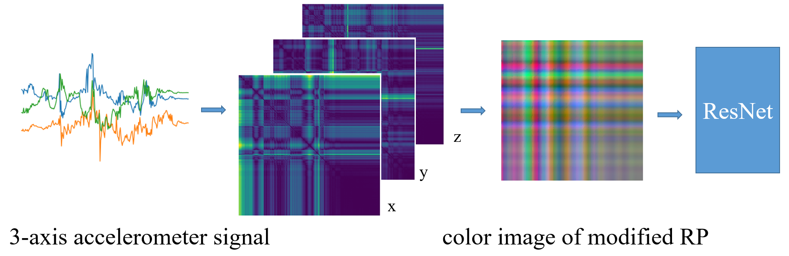
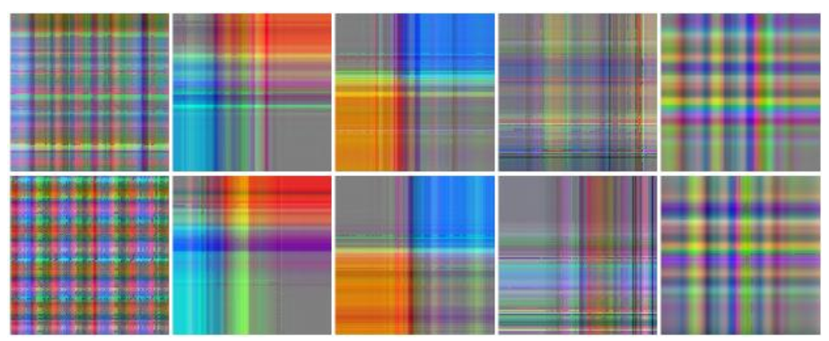
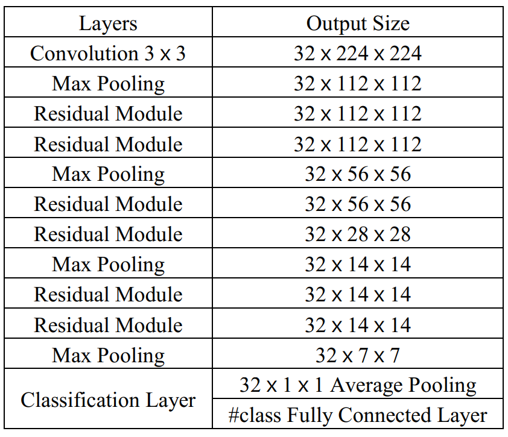

# Robust Single Accelerometer-Based Activity Recognition Using Modified Recurrence Plot

Paper: "Robust Single Accelerometer-Based Activity Recognition Using Modified Recurrence Plot"[[pdf]](https://ieeexplore.ieee.org/document/8691521)

An effective and efficient framework is proposed to address the recognition problem without any heavy preprocessing. Specifically, we encode 3-axis signals as 3-channel images using a modified recurrence plot (RP) and train a tiny residual neural network to do image classification. If you find this project useful, please cite the offical paper.

```
@article{lu2019robust,
  title={Robust Single Accelerometer-based Activity Recognition Using Modified Recurrence Plot},
  author={Lu, Jianjie and Tong, Kai-yu},
  journal={IEEE Sensors Journal},
  year={2019},
  publisher={IEEE}
}
```

**用我的滴滴云AI大师码0003在滴滴云上购买GPU/vGPU/机器学习产品可享受9折优惠，[点击](https://www.didiyun.com)前往滴滴云官网**

### Table of Contents
0. [Introduction](#introduction)
0. [Datasets](#datasets)
0. [Modified RP](#modifiedrp)
0. [Tiny ResNet](#tinyresnet)

### Update (Dec 14)
We redesigned a tiny classification model and now it can predict very fast (100x5s samples for 6.8s+ on GPU). As always, we welcome any questions, suggestions or bug-reports. 

### Introduction

The general overview of the proposed action recognition framework is shown as follows. It can be regarded as two stages. First, we project each channel signal as a square matrix using modified RP respectively and combine them into a color image. After normalization, we implement a tiny ResNet to do the classification task end to end. 

### Datasets

0. [ASTRI DATASET](https://github.com/lulujianjie/HAR_Using_ModifiedRP/tree/master/Datasets/MotionData)
Description is not available now for blind review

0. [ADL DATASET](https://archive.ics.uci.edu/ml/datasets/Dataset+for+ADL+Recognition+with+Wrist-worn+Accelerometer)
ADL is a public dataset
### ModifiedRP
The modified RP is first proposed in our paper to overcome its tendency confusion problem, which has improved our system performance significantly.

You can find more example of ASTRIA DATASET at [link1](https://github.com/lulujianjie/HAR_Using_ModifiedRP/tree/master/Datasets/Data%20Visualization/MotionData_modifiedRP) and ADL DATASET at [link2](https://github.com/lulujianjie/HAR_Using_ModifiedRP/tree/master/Datasets/Data%20Visualization/ADL_modifiedRP)

You can also encode your own accelerometer signals or time series data as images using [our code](https://github.com/lulujianjie/HAR_Using_ModifiedRP/blob/master/Model/encoding/RP-forADL.py)
	
### TinyResNet
You can train our model use [python](https://github.com/lulujianjie/HAR_Using_ModifiedRP/blob/master/Model/ResNet.py) or [jupyter notebook](https://github.com/lulujianjie/HAR_Using_ModifiedRP/blob/master/Model/ResNet.ipynb)

You can also use our pretrained model on ASTRI DATASET [link1](https://github.com/lulujianjie/HAR_Using_ModifiedRP/blob/master/Model/ResNet_best.pth) and ADL DATASET [link2](https://github.com/lulujianjie/HAR_Using_ModifiedRP/blob/master/Model/ResNet-ADL.pth) 

The structure is shown as follows

